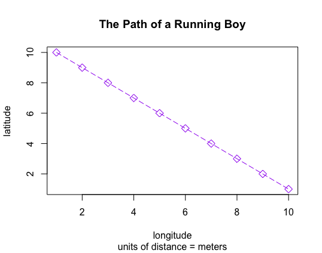

Here I created a simple plot using 2 objects, x & y, which contain the numbers 1-10, to generate the points. Then, I made specifications to the plot line and points, as well as adding labels and a title.

```
setwd("~/Documents/W&M/FALL 2020/DATA 100/R Studio Projects")
x<-1:10
y<-10:1
plot(x, y, type = "o", 
main = "The Path of a Running Boy", ##title
sub = "units of distance = meters", 
xlab = "longitude", ##x-label
ylab = "latitude", ##y-label
lty = 5, ##line type
lwd = 1, ##line width
col = "purple", ##plot color
pch = 5, ##point shape
cex = 1.25) ##point size
```
