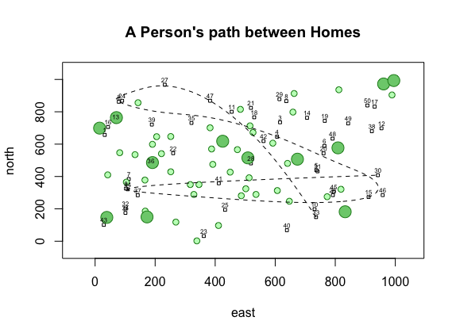

Here I created a simple plot using 2 objects, x & y, which contain the numbers 1-10, to generate the points. Then, I made specifications to the plot line and points, as well as adding labels and a title.

```
## Getting Started exercise pt. 1 ##

# make objects
x<-1:10
y<-10:1
# plot objects
plot(x, y, type = "b", 
  main = "The Path of a Running Boy", 
  sub = "units of distance = meters", 
  xlab = "longitude", 
  ylab = "latitude", 
  lty = 5, 
  col = "purple", 
  pch = 5, 
  cex = 1.25) 
```



I created a more advanced plot using various objects. The homes/dwellings are created using a random sample for the x and y coordinates and then plotting them as squares. I also labeled them numerically. Then, I plotted two different sized circles at random locations to represent trees. After that, I used a data frame for the home locations and bound the objects east and north (This creates an id, 1 - 50, for each home location). I randomly sampled 7 numbers from 1 - 50 and used them to choose the dwelling locations that will be part of the path. Lastly, I plotted the path with a spline that followed the 7 random dwelling locations.

```
## Getting Started exercise pt. 2 ##

#expand plot 
x <- 1:1000
y <- 1:1000

#make objects to represent location of homes
east <- sample(x, size = 50, replace = TRUE)
north <- sample(y, size = 50, replace = TRUE)

#plot homes
symbols(east, north, 
        squares = rep(10,50), 
        inches = FALSE)
        
#label each dwelling
text(x = dwellings$east,
     y = dwellings$north + 30,
     labels = dwellings$id, 
     cex = .5)

#plot small trees
symbols(sample(x, 40, replace = TRUE), 
        sample(y, 40, replace = TRUE), 
        circles = rep(10,40), 
        inches = FALSE,
        fg = "forestgreen",
        bg = "darkseagreen1",
        add = TRUE)

#plot big trees
symbols(sample(x, 12, replace = TRUE), 
        sample(y, 12, replace = TRUE), 
        circles = rep(20,12), 
        inches = FALSE,
        fg = "forestgreen",
        bg = "palegreen3",
        add = TRUE)

#create data frame for dwelling locations
dwellings <- cbind.data.frame(id = 1:50, east, north)

#randomly choose which homes to create path between
locs <- sample(1:50, 7, replace = FALSE)

#plot path between homes
xspline(x = dwellings[locs, ]$east, 
        y = dwellings[locs, ]$north,
        shape = -1,
        lty = 2)

title(main="A Person's path between Homes")
```
