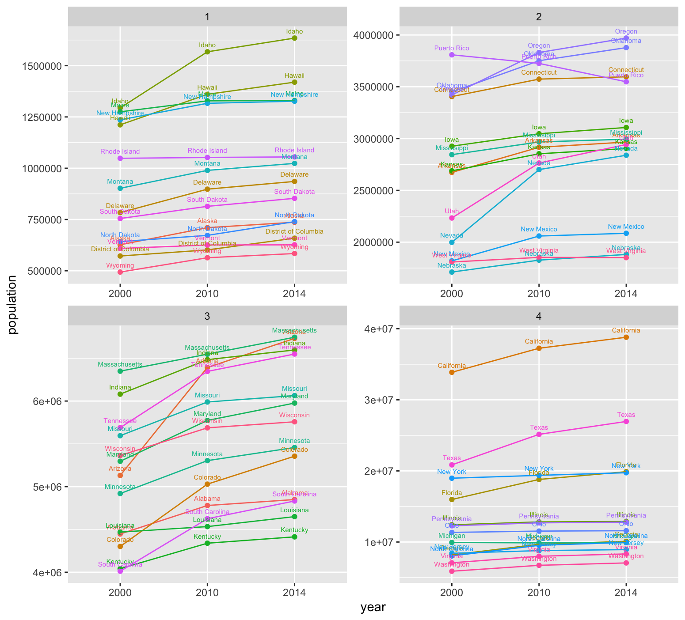

## Data Management Basics
### Merging, Categorizing, & the Grammar of Graphics

To complete this assignment, I retrieved public data from the National Center of Education Statistics, subsetted and analyzed the data, then used the  Grammar of Graphics package to present the data in a communicative and effective manner. 

## Data Management Foundations
### Application Program Interfaces & Tidying up your Data

Part two of this project involved retrieving data from the Federal Census Bureau using API calls. Then modifying and reformatting the data in order to bind three different years of datasets into one dataframe. Finally, I used ggplot to plot the data to show the population changes from 2000 to 2010 to 2014 in all 50 states and Puerto Rico.

