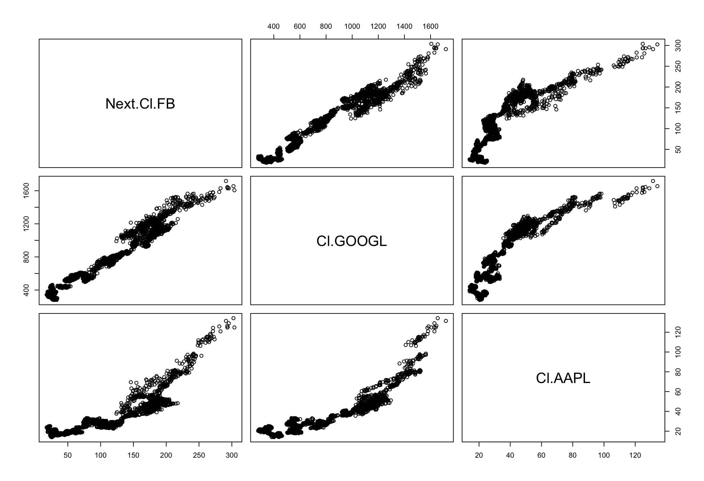
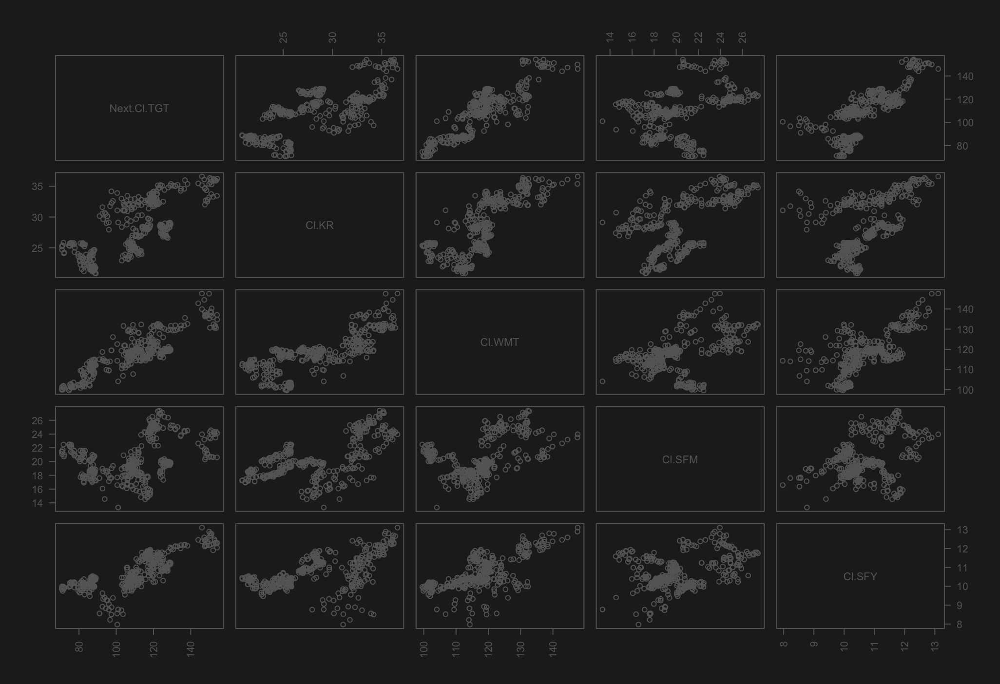
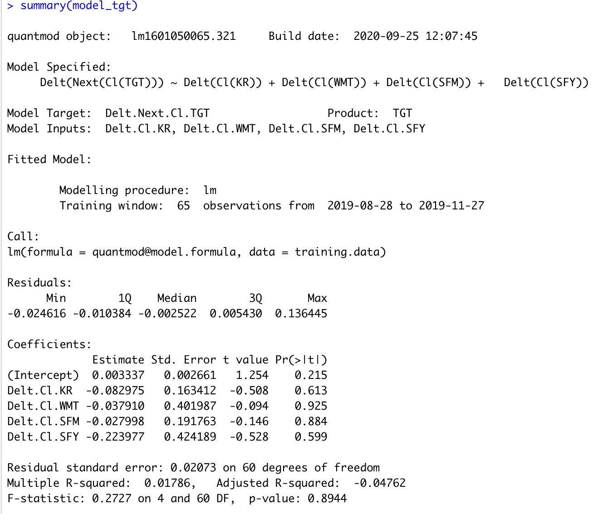

## Part 1: Data Management Fundamentals
### Independently Accessing an API and Creating your Own Plots

Part 1 of this project required me to obtain data from a remote server using an API. In this case, the data was American Community Surveys (ACS) from the Federal Census Bureau. I created a data frame using 5 years of data (2010-2014), containing the populations for the 52 primary U.S. subdivisions. With this data, I calculated the population increase and average growth rate for each subdivision across 5 years and plotted them using ggplot, faceting them into 9 quantiles. 

## Part 2: Introduction to Data Science
### Using the Stock Market to Describe, Analyze, and Predict

##### Using given example stocks

##### Using my own selected stocks

