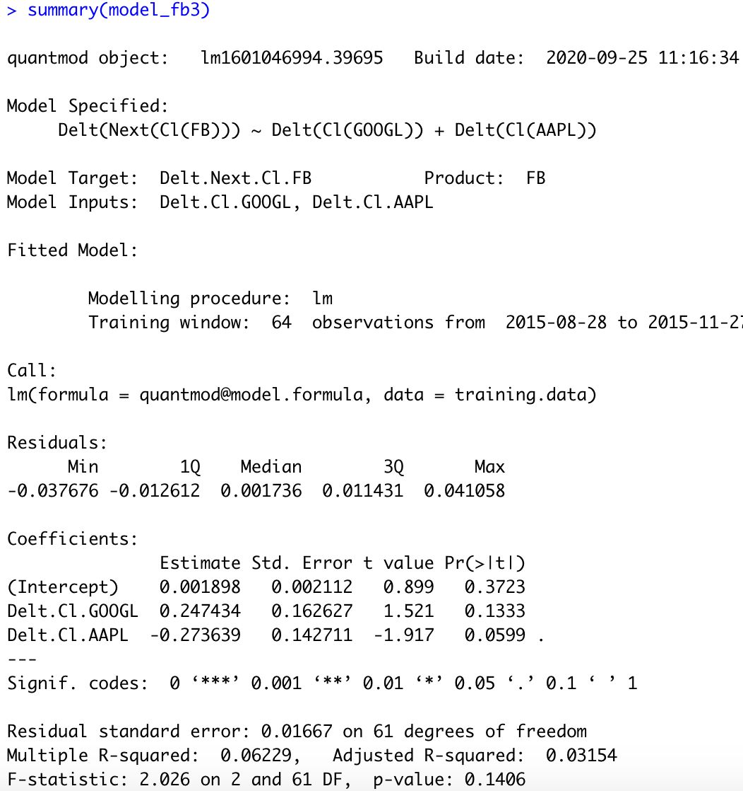
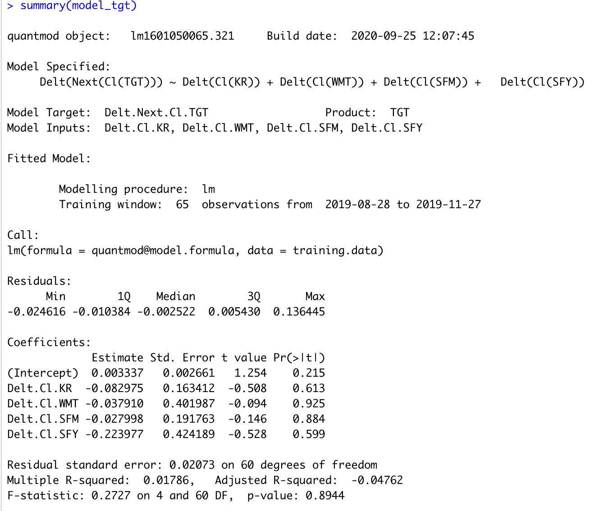

## Part 1: Data Management Fundamentals
### Independently Accessing an API and Creating your Own Plots

Part 1 of this project required me to obtain data from a remote server using an API. In this case, the data was American Community Surveys (ACS) from the Federal Census Bureau. I created a data frame using 5 years of data (2010-2014), containing the populations for the 52 primary U.S. subdivisions. With this data, I calculated the population increase and average growth rate for each subdivision across 5 years and plotted them using ggplot, faceting them into 9 quantiles. 

## Part 2: Introduction to Data Science
### Using the Stock Market to Describe, Analyze, and Predict

Part 2 of this project required me to obtain stock data using the quantmod package and analyze the data for patterns and predictors. I ran the code first using the companies given in the example: Apple, Facebook, and Google. Then I used my own choice of similar companies to produce plots and a statistical model: Target, Kroger, Walmart, Sprouts, and Safeway. I specified a model to predict Target's future stock price (response variable) using the current stock price of the other companies (predictor variables) using stock data from August to November of 2019. 

##### Using given example stocks

##### Using my own selected stocks

## Part 3: Introduction to Data Science
### Using tidyquant Analyze Stock Performance

Part 3 of the project involved using the tidyquant package to hypothetically manage a portfolio of stocks. I used the same stocks as the previous part and allocated $10,000 across my portfolio to optimize my profit. The graphs below show the portfolio returns and the growth over a two year period.

