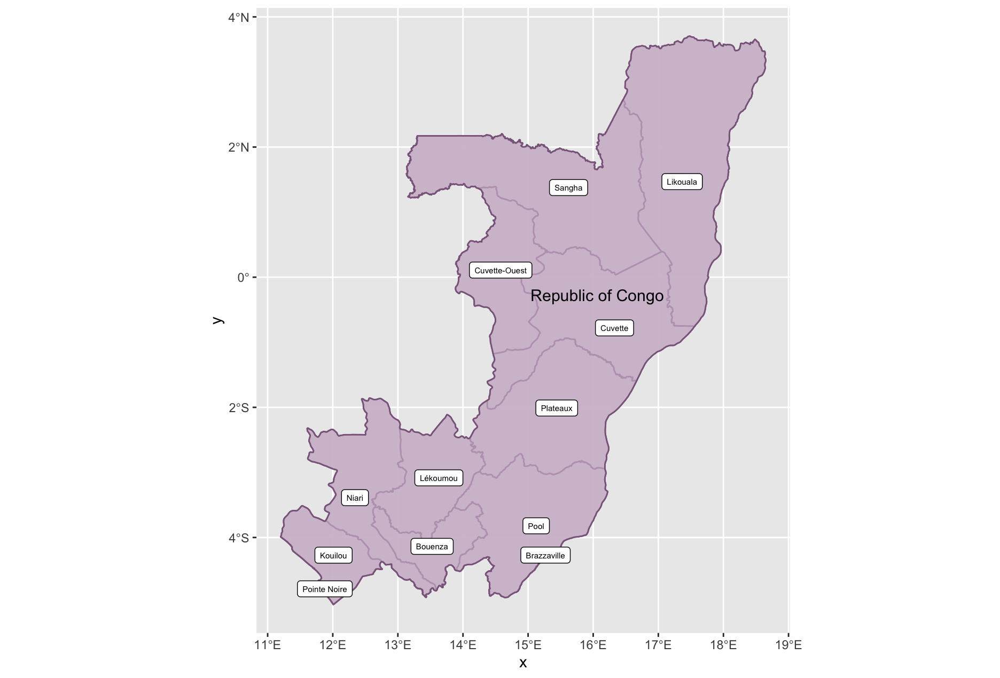
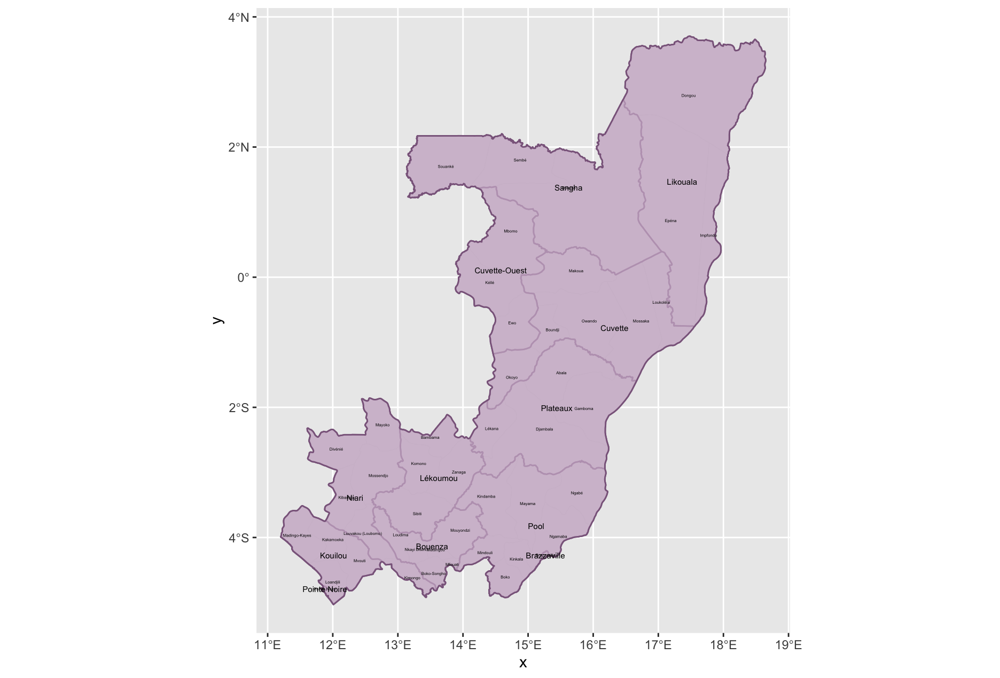
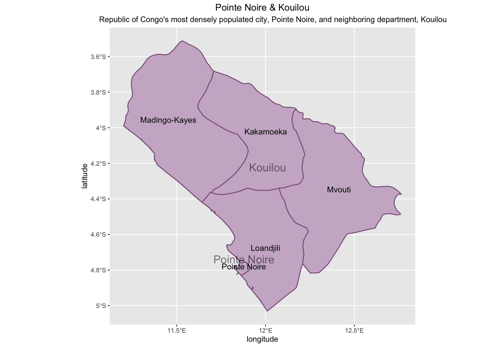
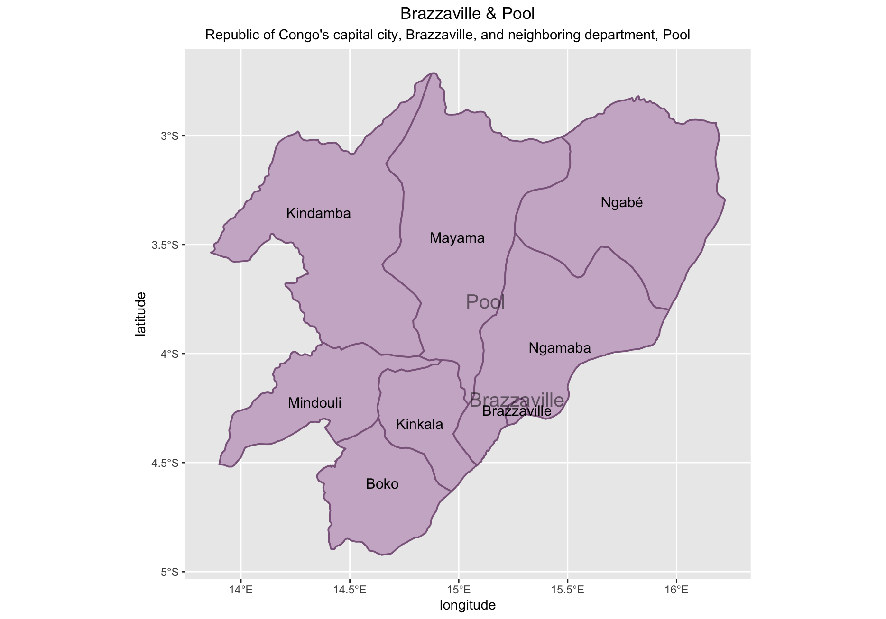

## Project 3: Projecting, Plotting and Labelling Administrative Subdivisions
### Republic of Congo

This project required downloading shapefile data from GADM for a country of choice. I chose the Republic of Congo. Then, using the tidyverse, gglot2, and sf packages, I plotted the data on the country's administrative subdivisions. In the Republic of Congo, the ADM1 subdivisions are called departments and the ADM2 subdivisions are called districts.

Republic of Congo and its departments

Republic of Congo and its departments and districts

*Since the two most densely populated departments of the country do not have ADM2 level subdivisions, I have included their neighboring department and its ADM2 subdivisions

