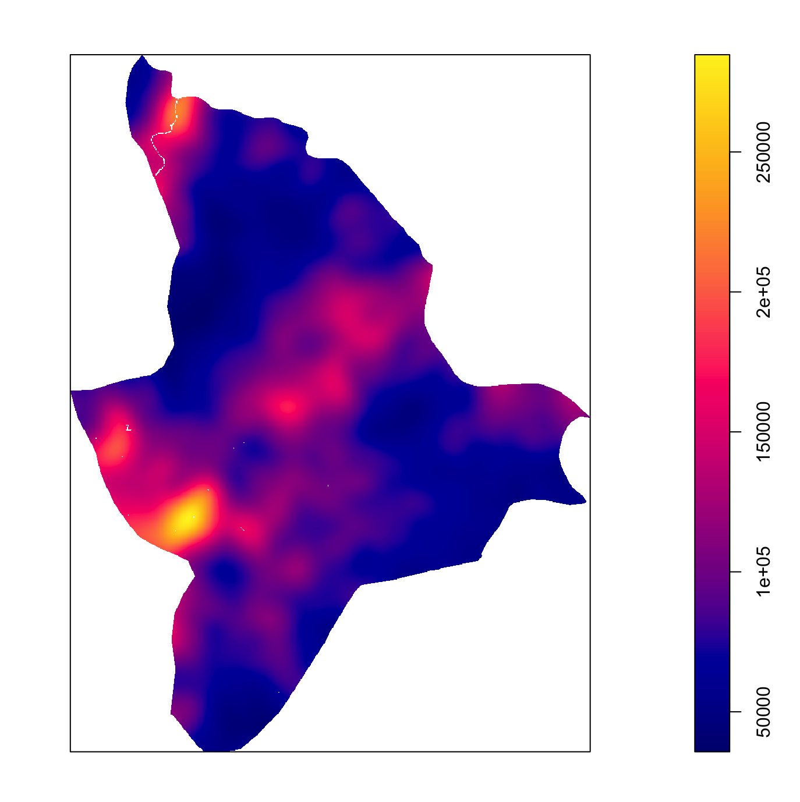
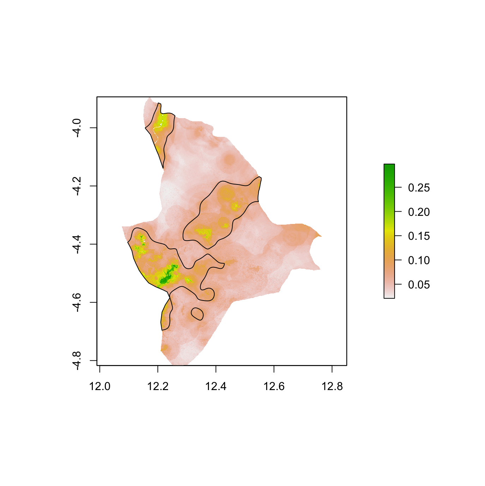
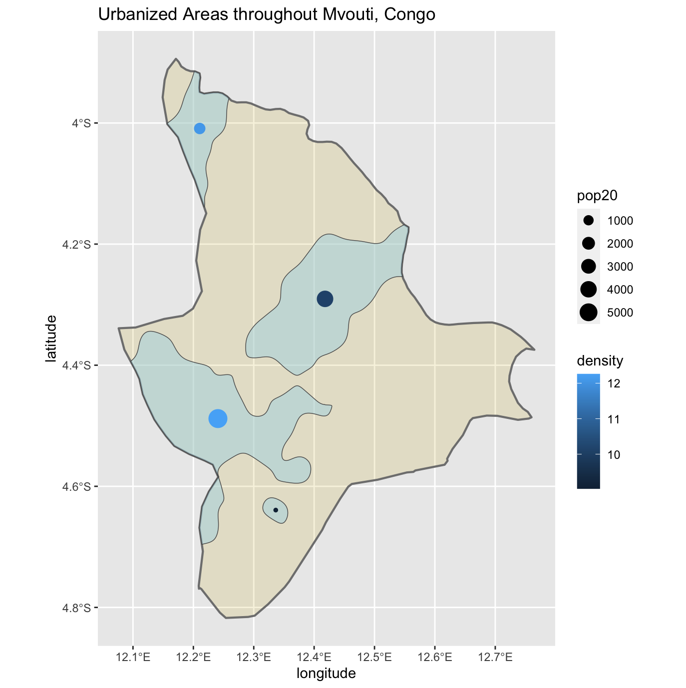
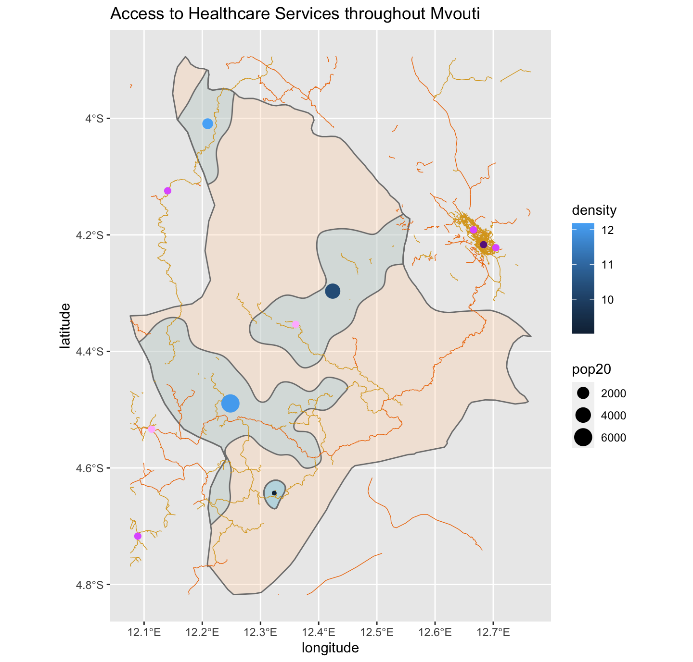

## Final Project: Mvouti
### Accesibility 1
The purpose of this part of the project was to focus on a single ADM2 of the country and identify the de facto boundaries of all urban areas based on the density of identified human settlements

### Accesibility 2
In this part of the project, the goal was to identify the road network and accessibility to healthcare of the urban regions of the ADM2.

