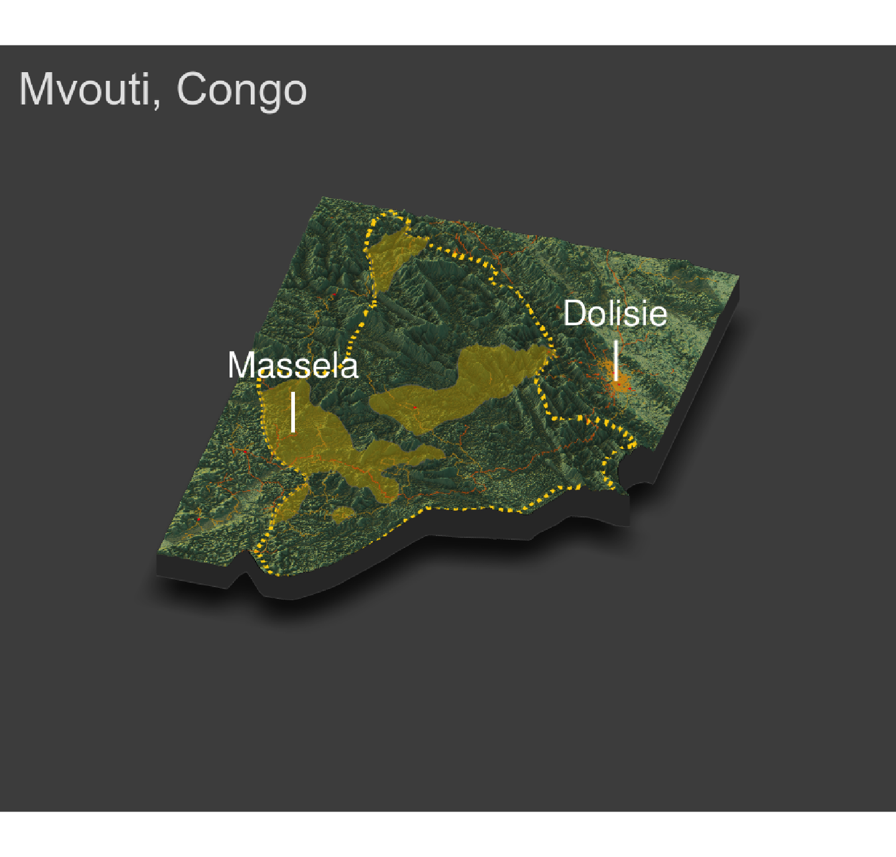

## Final Project: Mvouti
### Accesibility 1
The purpose of this part of the project was to focus on a single ADM2 of the country and identify the de facto boundaries of all urban areas based on the density of identified human settlements

First, I looked at the population density of Mvouti.

Then, based on that I selected the urban areas.

Finally, I plotted the urban areas with a legend that shows the density of each area.

### Accesibility 2
In this part of the project, the goal was to identify the road network and accessibility to healthcare of the urban regions of the ADM2.

1) The total population of Mvouti is 26869 and there were 4 urban areas.
2) The urban areas were pretty evenly distributed throughout Mvouti. The biggest one bordering Loandjili which is a more densley populated ADM2.
3) The roadways were hard to filter through since the majority of them were unclassified. The red-orange lines represent the unclassified and primary roads while the yellow lines represent the residential and secondary roads. Outside of Mvouti, to the northeast, is a cluster of yellow lines, presumably residential. There must be a city in that area. However, in Mvouti, the urban areas don't show as many roads as expected, this could be due to improper road classification.
4) The healthcare facilities are represented by the different shades of purple points. The big cluster has 3 of them which shows better access to healthcare than the urban areas of Mvouti which all have one or less healthcare facilities.
### Accesibility 3
In the final part of the project, I used Rayshader to produce a 3D, topogrpahic plot of Mvouti. I labeled the primary urabn area within Mvouti as well as the bigger city just outside of it.

1) The topographic map shows that Mvouti is very mountainous which has affected the development of urban areas. The urban areas are mostly in places where the terrain is slightly flatter. Dolisie, the city outside Mvouti, is located right at the edge of the mountains where the land is flat.
2) The road networks are definitely affected by the terrain as they go around the mountains. 
3) The healthcare facilities, represented by the red points, are impacted by the topography and only prevelant in areas where it is not mountainous. That is why there are so little actually wihthin Mvouti.
4) Overall, seeing the topography of Mvouti has changed my interpretation of the region. Now I understand why there isn't much urban development within it and the reason there is a big city just outside of the mountains.
