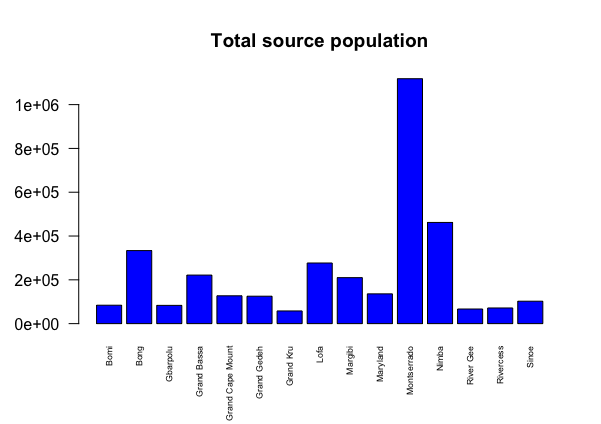
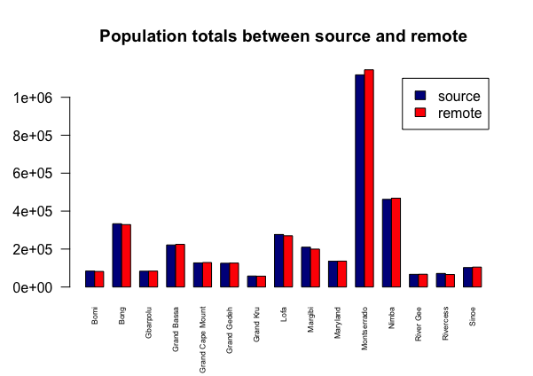
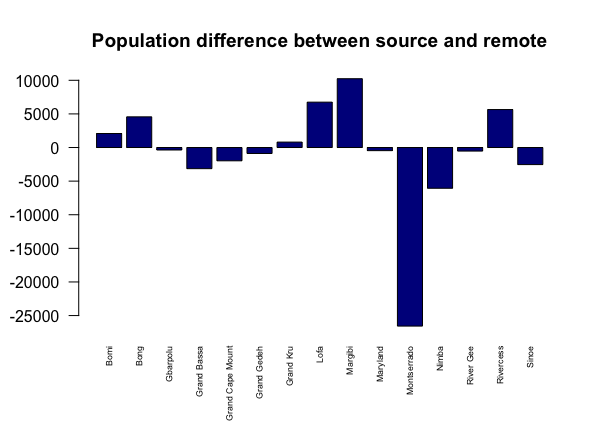
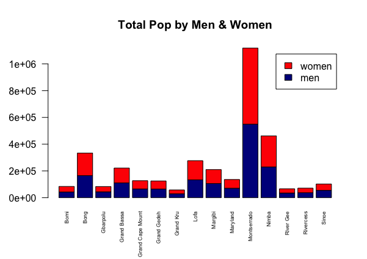
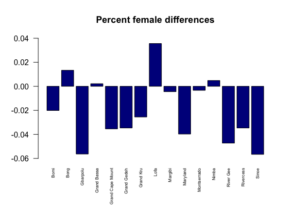
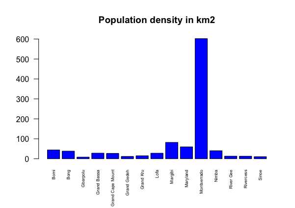

## Data Management Basics
### Exercise 1

For this assignment, I was given two sets of data, which contained the total population and demographics of Liberia, to import, modify, analyze, and plot. Below are the various bar graphs that I produced using R.

