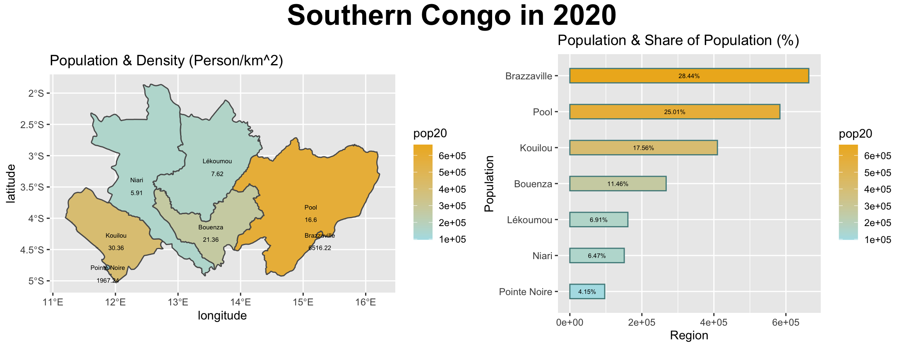

## Part 1: Extracting Populations from a Raster and Aggregating to each Unit
### Republic of Congo

For this project I had to subset the country I was doing because it had too many gridcells in the raster. So, my plots are all of the southern half of Congo where the two most populated cities are. This project is basically an extension of project 3. I took the shapefile data and combined it with raster data from WorldPop to model the population distribution of Congo.

Population distribution between ADM1s

Population distribution between ADM2s. I adjusted the scale to be logarithmic to decrease the interval.

Here, I adjusted the line weights to differentiate between ADM1 and ADM2. I also added the ADM1 labels, but at a lower alpha so it doesn't take over the map. As well as, adding another color for the midpoint of the scale.

Used Rayshader to generate a 3D plot and converted it to a GIF

## Part 2: Creating a Geometric Bar Plot with your Simple Feature object

