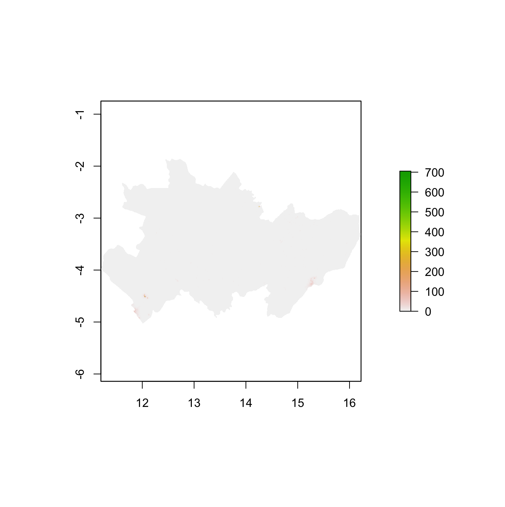
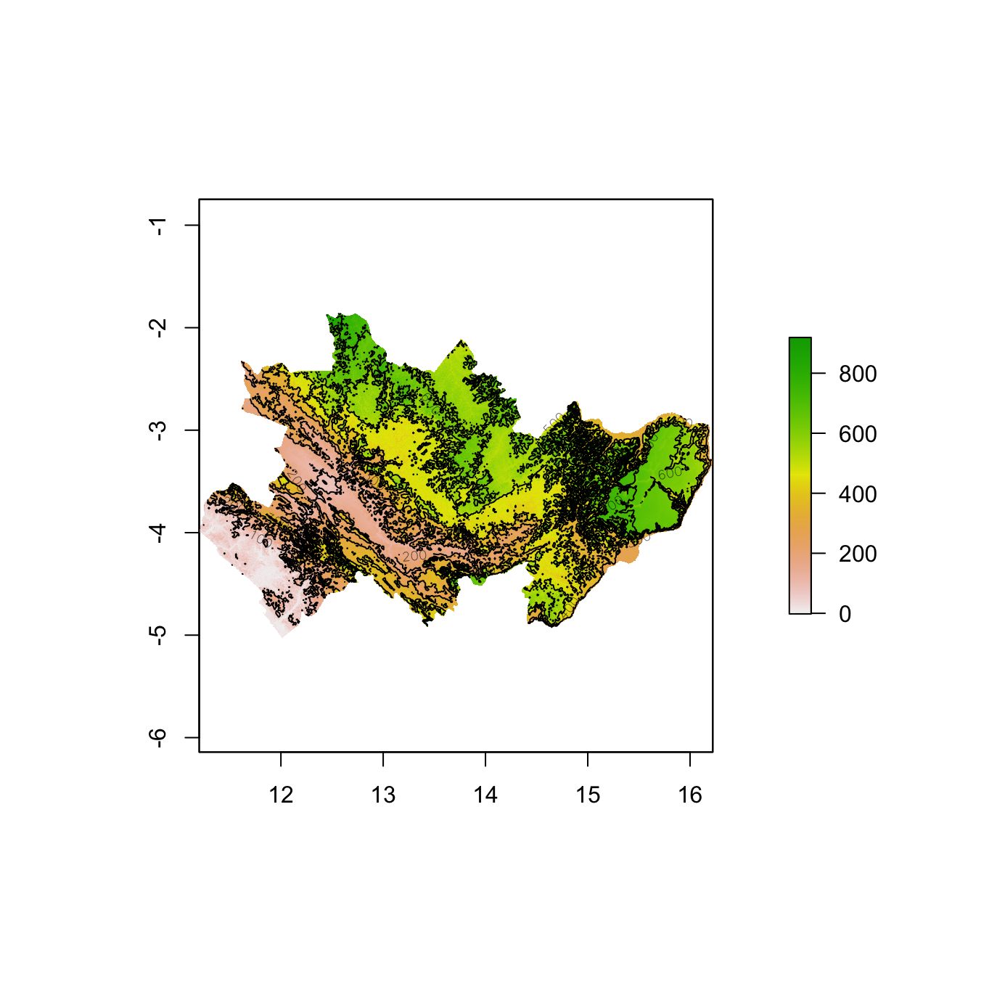
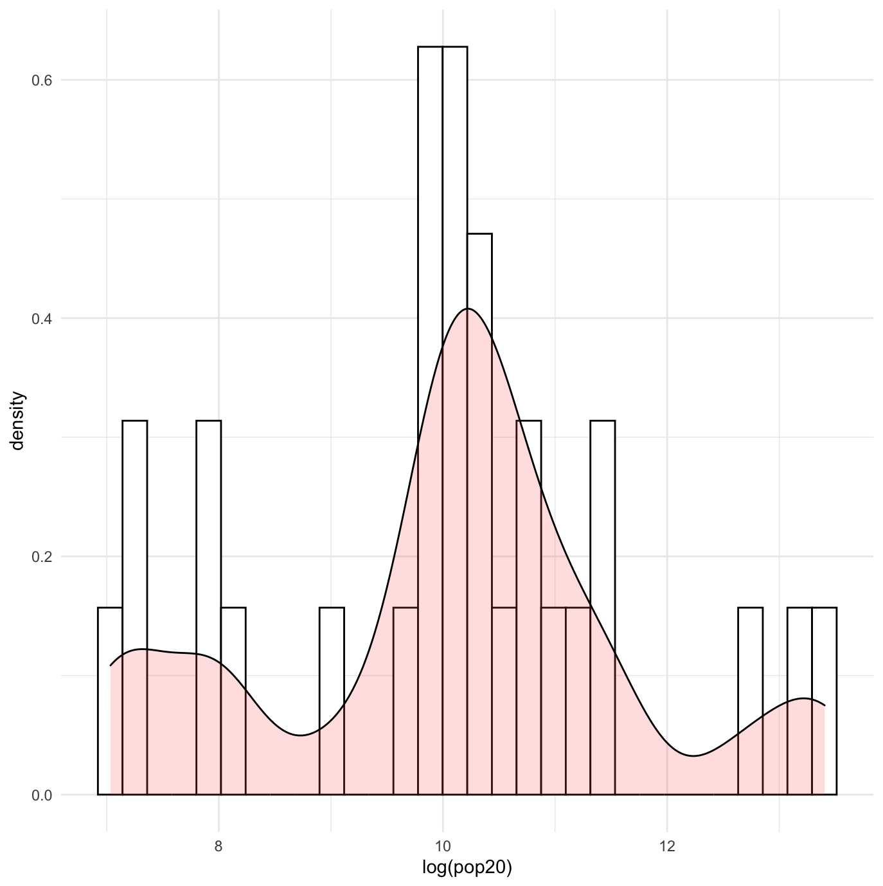
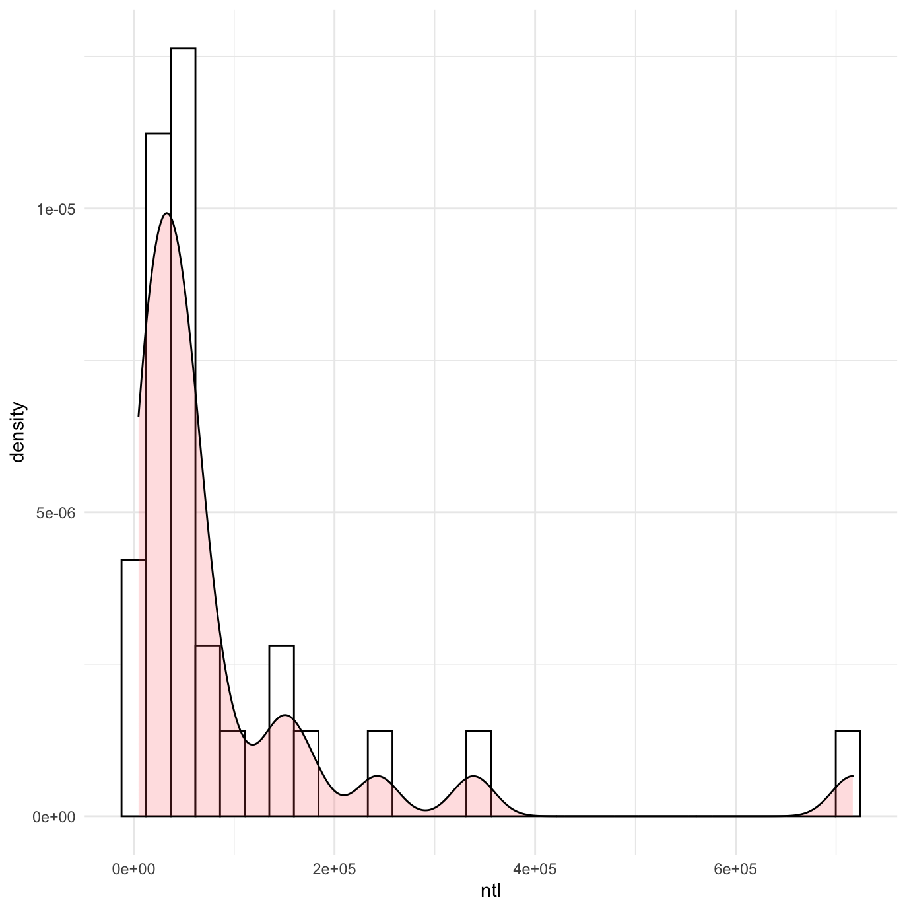
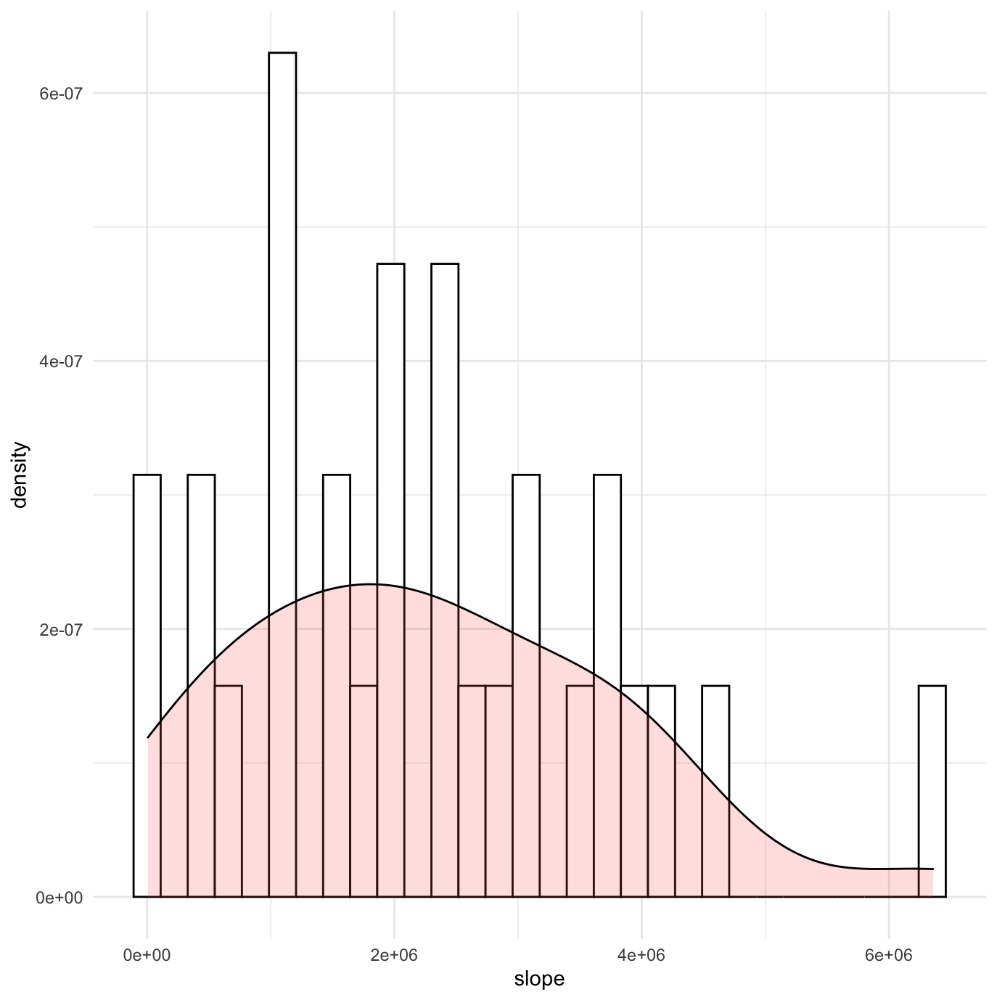

## Project 5
### Acquiring, Modifying and Describing the Data
In this project, I cropped and combined Rasters to produce a RasterStack. Next, I plotted some maps using the RasterStack object. Then I extracted data from the Raster and combined it with the country's adm2 object in order to be able to create histograms and density plots.

Night Time Lights of Southern Congo

*not much energy usage throughout the country except for a small amount in the most densely populated areas

Topography of Southern Congo

Histogram & Density Plot of Logarithmic Population

Histogram & Density Plot of Night Time Lights(NTL)

Histogram & Density Plot of Slope

