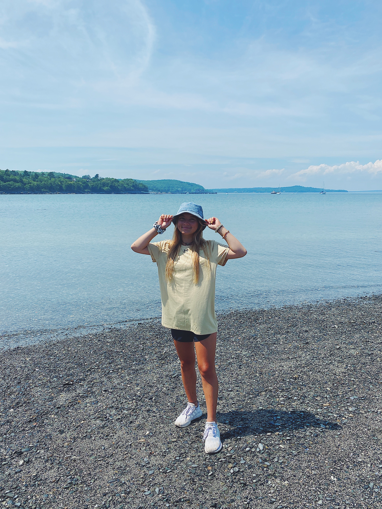

# Introduction
Hi! I'm Sofia and I'm hoping to major in Data Science. In my free time, I like to be outside hiking, walking, kayaking, skiing, etc. I'm also on the Women's Gymnastics Team here at W&M and can't wait to have an awesome freshman year!

 

## Project Index
=========================================================================

Aug. 22, 2020: [Getting Started with RStudio](08_22_20.md) 

Aug. 27, 2020: [Lab 0](08_27_20.md)

Sept. 4, 2020: [Project 1: Data Management Basics](09_04_20.md)

Sept. 7, 2020: [Data Science Reflection 1](reflection1.md)

Sept. 18, 2020: [Project 2: Data Management Fundamentals](09_18_20.md)

Sept. 21, 2020: [Data Science Reflection 2](reflection2.md)

Oct. 05, 2020: [Data Science Reflection 3](reflection3.md)

Oct. 09, 2020: [Project 3: Spatial Population Description](10_09_20.md)

Oct. 21, 2020: [Project 4: Extracting Populations from a Raster and Aggregating](10_21_20.md)
